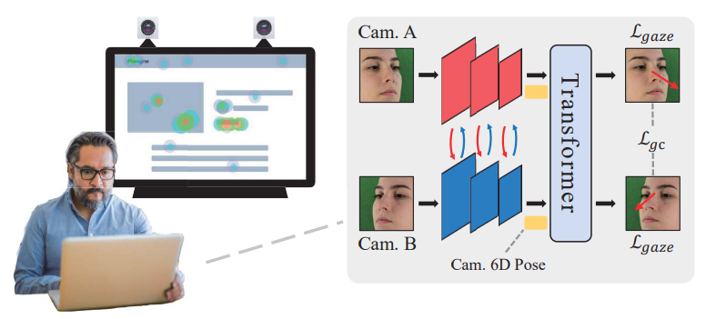
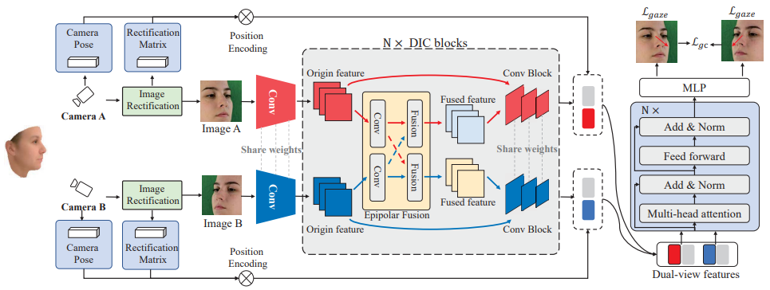

<h2> DVGaze: Dual-view Gaze Estimation    </h2>

   <i><a href="https://yihua.zone/">Yihua Cheng </a> and <a href='https://scholar.google.com.hk/citations?user=9ggbm0QAAAAJ&hl=en'>Feng Lu</a>,  ICCV 2023</i>
   

 

## Description
Dual cameras have been applied in many devices recently. In this paper, we explore a new direction for gaze estimation. We propose a dual-view gaze estimation network (DV-Gaze) including dual-view interactive convolution block and dual-view transformers. This work is accepted by ICCV 2023. 

## Comming Soon
We will release method and data-processing codes as soon as possible. 

